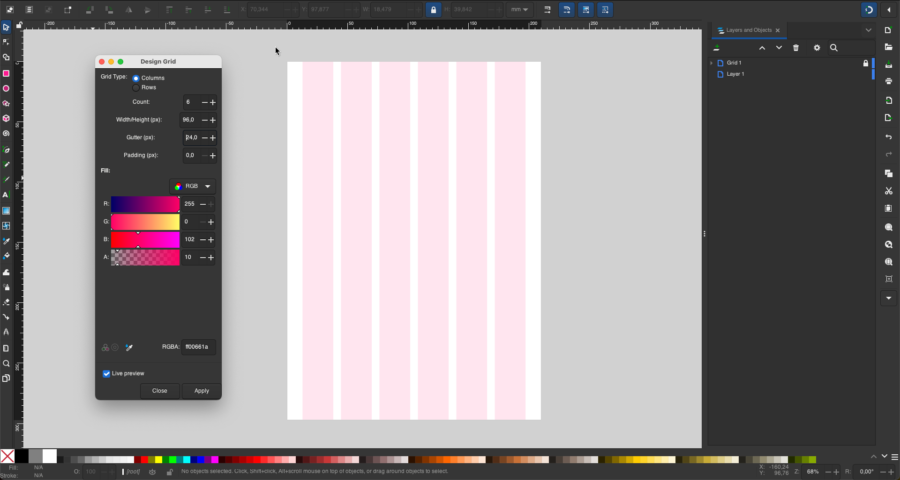
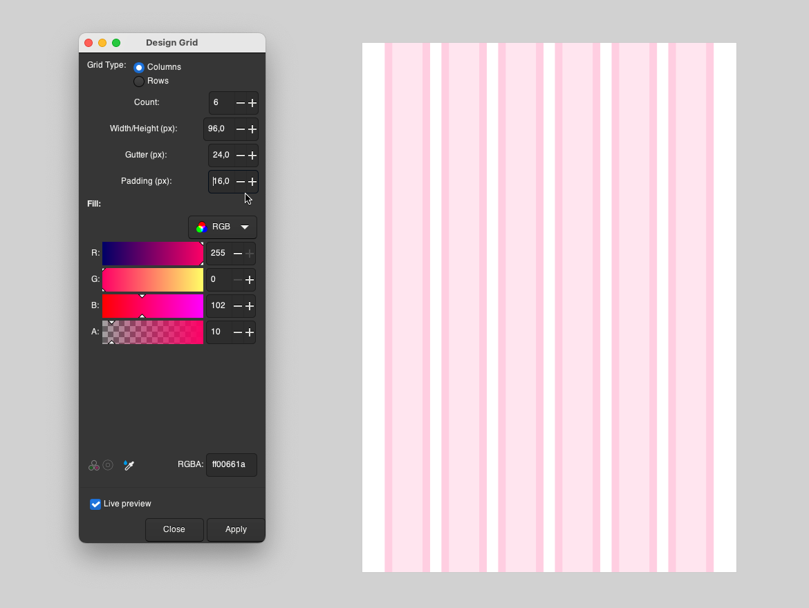
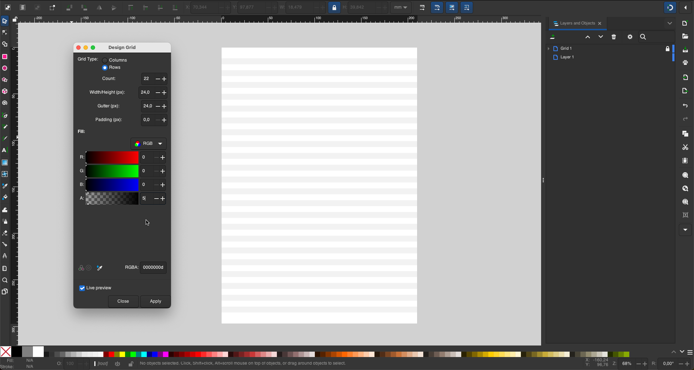
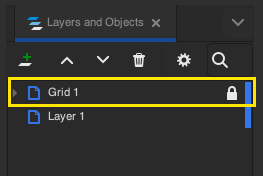

# **Design Grid**

A **powerful extension for Inkscape** that empowers designers and developers to create **responsive grids** effortlessly. Whether you're designing for the web or working on print projects, this extension provides the flexibility and control required for precise, grid-based designs.

---

## 🌟 Features

- **Customizable Grid Options:** Create grids with **columns** or **rows**.
- **Flexible Settings:**
  - Specify the **number** of columns or rows.
  - Adjust the **width/height** of each column/row.
  - Set **gutters** for spacing between columns/rows.
  - Add optional **padding** for enhanced spacing control.
- **Responsive Design:** Works seamlessly with any page size in Inkscape.
- Ideal for **web layouts, print design,** or any grid-based projects.

---

## 🤔 Why Was This Extension Created

While Inkscape already provides options for creating grids with guides, these can often feel unintuitive, cluttering the workspace with too many lines. After seeing the clean and modern grid functionality in tools like Figma, I wanted to bring a similar experience to Inkscape. The goal was to create a tool that is **intuitive, functional, and user-friendly,** enabling even beginners to incorporate grid-based design seamlessly into their projects.

---

## 🚀 Why Use This Extension?

Although Inkscape isn't primarily a prototyping tool like Figma, its versatility makes it a great choice for designers working on both **digital** and **print projects**. The Design Grid bridges the gap, offering a solution for quickly generating grids tailored to your needs. Whether you're building a web layout or designing brochures, this tool saves time and ensures consistency.

---

## 📥 Installation

1. **Download the latest release** from the GitHub repository.
2. Place the `design_grid.inx` file in the appropriate directory for your operating system:
    - **Linux:** `~/.config/inkscape/extensions/`
    - **Windows:** `%APPDATA%\inkscape\extensions\`
    - **MacOS:** `~/Library/Application Support/org.inkscape/extensions/`
3. Make sure the `design_grid.py` script is in the same directory as the `.inx` file.
4. **Restart Inkscape** to load the extension.

---

## 🛠️ How to Use

1. Open Inkscape.
2. Navigate to **Extensions** > **Render** > **Design Grid**.
3. Customize your grid settings:
    - **Grid Type:** Choose between **Columns** or **Rows**.
    - **Count:** Specify the number of columns/rows.
    - **Width/height:** Set the width/height of each column/row.
    - **Gutter:** Adjust spacing between columns/rows.
    - **Padding:** Add optional padding for better spacing control.
4. Click **Apply** to generate your grid.
5. **Enable snapping:** Ensure the **snapping tool** (top-right corner of Inkscape) is active for better alignment and usability of the grid.

6. **New Grid Layers:** Each time you create a new grid, a new layer is automatically generated with the name **"Grid 1," "Grid 2,"** and so on. These layers are **locked** by default, so they won't interfere with your design work.

---

## 📝 License

This project is licensed under the **GNU General Public License v3.0**. You are free to redistribute and modify the code under the terms of this license.

The full text of the GNU GPL-3.0 license can be found here: [GNU GPL-3.0 License](https://www.gnu.org/licenses/gpl-3.0.html).

---

## 📬 Contact

Have questions, suggestions, or want to contribute? Feel free to reach out!
- **Email:** heriton.agoncalves@gmail.com
